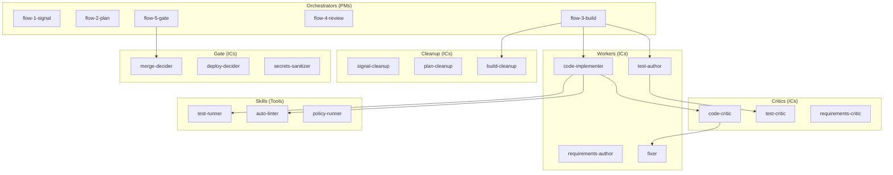

# Org Design as Code

> The pack is organizational architecture, compiled into prompts and flows.

---

## The Meta-Pattern

The swarm is not prompt engineering. It is organizational architecture encoded as executable specifications.

When we say "PM + IC model," we mean:

- Orchestrator prompts are designed like PM job descriptions
- Agent prompts are designed like IC role definitions
- Handoffs work like status updates in a well-run team

This is not analogy. It is implementation.

---

## The Roles



| Role                | Responsibility                    | Pattern                         | Examples                      |
| ------------------- | --------------------------------- | ------------------------------- | ----------------------------- |
| Orchestrators (PMs) | Route, sequence, checkpoint       | Read handoffs, decide next step | flow commands                 |
| Workers (ICs)       | Implement, produce artifacts      | Do focused cognitive work       | code-implementer, test-author |
| Critics (ICs)       | Find problems, produce worklists  | Adversarial review              | code-critic, test-critic      |
| Cleanup (ICs)       | Compress, summarize, verify state | Context reduction               | \*-cleanup agents             |
| Gate (ICs)          | Make judgment calls, decide       | Authority to proceed/bounce     | merge-decider, deploy-decider |
| Skills (tools)      | Execute deterministically         | Return machine truth            | test-runner, auto-linter      |

---

## Why This Structure Works

### Mission Command

From military doctrine: commander sets intent + constraints + acceptance criteria. Units act autonomously within boundaries. System gates boundary crossings.

Applied here:

- Orchestrator sets the task + constraints + success criteria
- Agent acts autonomously inside the sandbox
- Gates verify at publish boundaries

This is not "AI helps you code faster." This is an industrial control loop where intent flows through autonomous units to produce verified outcomes.

### Separation of Concerns

Critics never fix (conflict of interest). Implementers never commit (git expertise centralized). Gates do not trust previous agents (fresh verification).

This prevents:

- Critic rubber-stamping its own fixes
- Implementers fighting git instead of coding
- Accumulated trust replacing verification

**Example:** When `code-critic` finds an issue, it reports to `fixer`. It does not fix the issue itself. This separation ensures honest assessment: a critic who fixes has incentive to underreport problems to reduce their own workload.

### Adversarial Roles

LLMs are sycophantic by default. They agree to please. Structural opposition forces honest assessment:

- Author produces, Critic attacks
- Implementer claims done, Gate verifies
- Agent says "clean," Skill returns exit code

The system is designed assuming each agent might lie or be wrong. Adversarial structure forces honesty through verification, not trust.

---

## The Communication Pattern

Agents communicate through:

1. **Artifacts on disk** (durable, reviewable)
2. **Handoff recommendations** (routing guidance)
3. **Natural language** (Claude understands, no parsing needed)

Not through:

- JSON routing schemas
- Closed enums of next steps
- Machine-parsed control blocks

**Why natural language?** Claude understands prose. Rigid schemas force agents into categories that may not fit. An agent that says "I completed 3/5 ACs, recommend routing to fixer for the auth issue, then back to me" communicates more information than `{ "status": "PARTIAL", "next": "fixer" }`.

---

## Neighbors, Not Global Knowledge

Each agent knows 3-4 likely handoff targets (neighbors), not the entire swarm:

```
code-implementer neighbors:
- code-critic (for review)
- test-author (for test updates)
- fixer (for issues found)
- repo-operator (when ready to commit)
```

This keeps agent prompts focused and context light. An agent does not need to know about `wisdom-harvester` to do its job in Build.

**The routing table is implicit.** Orchestrators read handoffs and route based on understanding. Agents recommend next steps. The system routes via understanding, not via lookup tables.

---

## The Microloop Pattern

Inside a flow, work often loops:

```
Author -> Critic -> Fix -> Author (refined) -> Critic (satisfied) -> Continue
```

**Stopping condition:** Critic runs out of ammunition OR quality threshold met.

This is not orchestrator logic. It is local optimization within a flow. The orchestrator says "implement AC-001." The implementation loop runs until the work is done or blocked.

### Why Microloops Work

| Without Microloops                               | With Microloops                                          |
| ------------------------------------------------ | -------------------------------------------------------- |
| Submit PR, wait for review, get feedback, revise | Iterate until quality threshold before any human sees it |
| 3-day review cycles                              | Quality issues caught in minutes                         |
| Human attention on mechanical issues             | Human attention on genuine decisions                     |

Machine iteration is cheap. Human iteration is expensive. The microloop trades tokens for attention.

---

## Why Not a DAG?

Traditional workflow systems use directed acyclic graphs with explicit edges.

We use:

- Recommendations (not commands)
- Understanding (not parsing)
- Local knowledge (not global routing tables)

### DAG Limitations

A DAG requires:

- Enumerated states
- Explicit edge definitions
- Schema changes for new routes

This creates:

- Brittleness (unexpected states fail)
- Rigidity (new routes require schema updates)
- Complexity (routing logic accumulates)

### Our Approach

Agents recommend. Orchestrators understand. Routes emerge from conversation.

**Example:** If `code-implementer` discovers it needs a database migration:

- **DAG approach:** Is there an edge from `code-implementer` to `migration-author`? If not, fail or route to catch-all.
- **Our approach:** Agent says "I need a migration for the users table. Recommend routing to whoever handles DB changes or creating the migration myself." Orchestrator understands and routes appropriately.

The system is:

- Resilient to unexpected states
- Adaptable without schema changes
- Debuggable through natural language

---

## The Compilation Process

Traditional software compiles source code into machine instructions.

This pack compiles org design into:

| Org Design Element  | Compiled Into                                |
| ------------------- | -------------------------------------------- |
| Role definitions    | Agent prompts (`.claude/agents/*.md`)        |
| Workflows           | Flow commands (`.claude/commands/flow-*.md`) |
| Policies            | Gate logic, critic criteria                  |
| Communication norms | Handoff structure                            |
| Quality standards   | Critic severity levels, verification gates   |

**The compiler is the pack author.** Reading org design literature and encoding it into prompts is compilation. The prompts are the bytecode.

---

## What We Are Encoding

Three bodies of organizational theory, compiled into executable code.

### Teal Organization Principles

From Laloux's _Reinventing Organizations_:

**Self-management within role:**

- Each agent owns their domain completely
- No micromanagement from orchestrators
- Single responsibility enables autonomy
- The sandbox is the constraint, not per-action permissions

**Whole-person engagement:**

- Agents bring judgment, not just execution
- Real cognitive work, not template filling
- Graceful outcomes include honest uncertainty
- Partial progress with clear reporting is valid

**Evolutionary purpose:**

- Wisdom loop improves the system
- Templates evolve based on learnings
- The org gets smarter over time

### Agile Principles

From the manifesto and its descendants:

**Short feedback loops:**

- Microloops iterate quickly (write, critique, fix, verify)
- Critics catch issues fast (per-AC, not per-feature)
- Fix-forward maintains momentum

**Working software over documentation:**

- Receipts capture what happened, not what was planned
- Evidence over claims
- The diff is the audit surface; tests are the runtime truth

**Responding to change:**

- Resume from disk state
- Adapt to what exists
- Local resolution before escalation

### Modern PM/IC Dynamics

From contemporary tech org design:

**PM as context-holder:**

- Orchestrator maintains intent
- Routes based on understanding
- Does not parse, reads
- Coordinates without micromanaging

**IC as expert:**

- Deep work in narrow domain
- Honest reporting
- Recommends next steps
- Makes decisions within scope

---

## Concrete Examples

### PM/IC Boundary

**Org theory:** PMs scope work and remove blockers. ICs do the technical work. Mixing these roles creates confusion.

**Pack encoding:** Orchestrators call agents and route on results. They do not parse files or run commands. Agents do the work and report back. Orchestrators never reach into agent work; agents never route themselves.

### Single Responsibility

**Org theory:** Teams work best when each member has one clear job. Overlapping responsibilities create coordination overhead and diffuse accountability.

**Pack encoding:** `code-implementer` writes code. `code-critic` reviews code. `fixer` fixes issues. No overlap. If a critic spots an issue, they report it; they do not fix it themselves.

### Psychological Safety

**Org theory:** Teams perform better when members can report problems without fear of blame. Honest uncertainty beats false confidence.

**Pack encoding:** `PARTIAL` is a valid completion status. Agents are explicitly told that honest partial reports are successful outcomes. "I completed 2/5 ACs, blocked on missing schema" is a verified success.

### Research Before Escalating

**Org theory:** Good ICs investigate problems themselves before asking for help. Escalation should be the last resort.

**Pack encoding:** Agents have a five-step escalation ladder. They investigate locally, derive from evidence, choose safe defaults, then escalate "only when boxed in."

---

## Implications for Pack Authors

If you are extending or forking this pack:

**Think in org design first.** Before writing a new agent prompt, ask: "What role is this person playing on the team? What is their job description?"

**Encode the team you want.** If you want agents to pair-program, encode pair-programming practices. If you want strict code review, encode strict review criteria.

**Test with org theory.** When something is not working, ask: "Would this team dynamic work with humans?" If the handoff is broken, the handoff is broken, regardless of whether agents or humans are doing it.

**Update the org, not just the code.** When you change agent behavior, you are changing your org design. Be intentional about it.

---

## One Sentence

> The pack is org design, compiled into prompts and flows.

---

## See Also

- [agent-philosophy.md](agent-philosophy.md) — How agents think and work
- [operating-model.md](operating-model.md) — The full operating model
- [architecture.md](architecture.md) — Technical implementation
- [why-ops-first.md](why-ops-first.md) — Default-allow engineering philosophy
