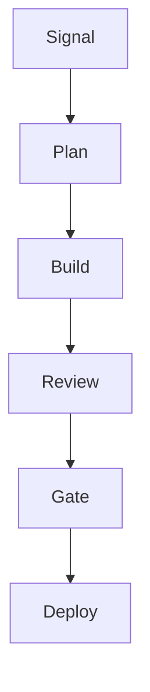

# PR as Review Surface

> The PR description is the product. Make it worth reading.

---

## The Goal

Devs get a **large, high-quality, well-tested change** they can **quickly review and approve from the PR interface itself**.

Everything is:

- **Tested and verified** (evidence exists)
- **Well explained** (context is in the PR)
- **Visually clear** (diagrams, structured sections)

The reviewer should never need to dig through `.runs/` artifacts or read 500 lines of diff to understand what happened. The PR description tells them.

---

## The PR as Cockpit

Most reviewers only read the PR description. They skim the diff, maybe click into one or two files, and make a decision. This is reality, not laziness.

So the PR description must be the **complete review surface**:

### Required Sections

1. **Summary** - What changed (1-3 bullets)
2. **Review Map / Hotspots** - Where to look if spot-checking
3. **Proof Summary** - Evidence pointers + explicit "not measured"
4. **Visual Architecture** - Mermaid diagrams where helpful
5. **What's Left** - Known gaps, future work
6. **Reproduce** - How to verify locally

Each section serves a purpose. Miss one and the reviewer has to go hunting.

---

## Visual Forms

Use visuals people understand at a glance. Text is for explanation; visuals are for orientation.

### Mermaid Flow Diagrams

Show how components connect or how data flows:



Use these when:

- Showing the affected flow path
- Illustrating component relationships
- Mapping request/response patterns

### Status Tables

Show verification state at a glance:

| Check       | Status     | Evidence             |
| ----------- | ---------- | -------------------- |
| Tests       | PASS 47/47 | `test_report.md`     |
| Security    | PASS Clean | `security_scan.md`   |
| Mutation    | WARN 87%   | `mutation_report.md` |
| Performance | --         | not measured         |

The table is scannable. Green/yellow/red status. Evidence pointers for drill-down.

### Change Maps

Show what changed where:

```
src/
  auth/
    login.rs (modified) <- HOTSPOT
    session.rs (new)
  api/
    routes.rs (modified)
tests/
  auth_test.rs (new)
```

This tells the reviewer: "If you only look at one file, make it `login.rs`."

---

## The Review Posture

The reviewer should be able to:

1. **Read the summary** - Understand what changed in 30 seconds
2. **Check the proof table** - Verify evidence exists for each claim
3. **Scan the hotspots** - Know where to look if spot-checking
4. **Approve with confidence** - Without reading every line

If they need to dig into the diff, the hotspots tell them where to focus.

### What This Enables

Large changes become reviewable. A 500-line PR might have 3 hotspots that matter. The rest is boilerplate, generated code, or obvious changes. Point the reviewer at the 3 hotspots and let them verify the proof table.

This is **not** about reducing review quality. It's about focusing review effort where it matters. The quality is proven by evidence; the reviewer validates the evidence is real.

---

## Evidence Pointers

Every claim links to evidence. No claim without a pointer.

| Claim               | Evidence Format                      |
| ------------------- | ------------------------------------ |
| "Tests pass"        | `test_report.md` or CI link          |
| "Security clean"    | `security_scan.md` or scanner output |
| "Matches spec"      | `adr.md` + specific BDD scenarios    |
| "Coverage adequate" | `coverage_report.md` with percentage |

### The Pointer Rule

If you claim it, point to it:

```markdown
### Proof (measured vs not measured)

- Gate: PASS (evidence: `.runs/feat-auth/gate/gate_receipt.json`)
- Tests: 47 passed (evidence: `.runs/feat-auth/build/test_execution.md`)
- Mutation: 92% killed (evidence: `.runs/feat-auth/gate/mutation_report.md`)
```

### "Not Measured" Is Honest

Explicit gaps are better than hidden ones:

```markdown
### Not Measured

- Performance: not measured (out of scope for this PR)
- Accessibility: not measured (no a11y tests configured)
- Integration tests: skipped (requires external service)
```

This tells the reviewer exactly what wasn't verified. They can decide if that matters for this change.

---

## The Diff is Audit, Not Primary Review

Three surfaces exist:

| Surface            | Purpose          | Audience                             |
| ------------------ | ---------------- | ------------------------------------ |
| **PR Description** | The cockpit      | Reviewers making decisions           |
| **Diff**           | Spot-check/audit | Reviewers validating specific claims |
| **Receipts**       | Evidence trail   | Future auditors, debugging           |

The PR description is primary. The diff is for spot-checking what the cockpit claims. Receipts are the underlying truth for anyone who needs to verify claims later.

### How This Changes Review

**Old model:** Read the entire diff, understand what changed, hope nothing was missed.

**New model:** Read the summary, verify proof exists, spot-check the hotspots if needed.

The machine did the exhaustive checking. The human validates that the checking happened.

---

## Why This Works

### 1. Large Changes Become Reviewable

A 2000-line change is terrifying. But if you know:

- Tests pass (here's the evidence)
- Security clean (here's the scan)
- Core logic is in 3 files (here are the hotspots)
- Coverage improved (here's the delta)

...then you can review the hotspots and approve with confidence. The evidence summary replaces line-by-line reading.

### 2. Quality is Proven, Not Trusted

The PR doesn't say "we tested this thoroughly." It says:

- 47 tests ran (evidence: test_report.md)
- 3 new test files added
- Mutation testing killed 92% of mutants
- Security scan found 0 issues

Proof over vibes. Evidence over narrative.

### 3. Context is Preserved

Future readers understand why:

- What problem was solved
- What approach was taken
- What constraints applied
- What was explicitly out of scope

The PR description is documentation for posterity, not just a merge gate.

### 4. Approval is Fast

Everything needed is in one place:

- What changed (summary)
- Why it's safe (proof)
- Where to look (hotspots)
- How to verify (reproduce)

The reviewer doesn't hunt for information. It's all in the cockpit.

---

## The Template

````markdown
## Summary

- [What changed, 1-3 bullets - user-visible or contract-visible]

## Review Map

[Mermaid diagram or file tree showing affected areas]

### Hotspots

- `src/auth/login.rs:45-67` - Core auth logic change
- `src/auth/session.rs` - New session management
- `tests/auth_test.rs` - New test coverage

## Verification

| Check    | Status | Evidence                 |
| -------- | ------ | ------------------------ |
| Tests    | PASS   | [test_report.md](link)   |
| Security | PASS   | [security_scan.md](link) |
| Lint     | PASS   | CI output                |

### Not Measured

- [Explicit gaps - what wasn't verified and why]

## Reproduce

```bash
npm test
npm run security-scan
```
````

## What's Left

- [Future work, known limitations, follow-up items]

````

---

## Anti-Patterns

### The Empty Summary

```markdown
## Summary
- Updated code
````

This tells the reviewer nothing. What code? Why? What changed for users?

### The Missing Proof

```markdown
## Verification

All tests pass and the code is secure.
```

No evidence pointers. No specifics. This is a narrative claim, not proof.

### The Hidden Gap

```markdown
## Verification

Tests pass. Security scan clean.
```

What about the things you didn't measure? Reviewers assume comprehensive checking unless told otherwise.

### The Wall of Text

```markdown
## Changes

This PR implements the new authentication system by refactoring the
existing login flow to use JWT tokens instead of session cookies. The
session management was updated to handle token refresh and the security
layer now validates...
```

Nobody reads this. Use bullets, tables, and visuals.

---

## The Economics

Machine time is cheap. Human attention is expensive.

The pack spends compute running tests, mutation analysis, security scans, and verification. This generates evidence.

The PR description **converts evidence into human-digestible form**. The reviewer validates that evidence exists, not that every line is correct.

This is the trade: cheap machine cycles buy expensive verification, so human review time goes to judgment calls (hotspots, design decisions) rather than mechanical checking.

---

## The Key Insight

> **The PR description is the product. Make it worth reading.**

If the PR description is thorough, accurate, and well-organized:

- Reviewers approve confidently
- Future readers understand context
- Audit trails are complete
- Quality is proven, not assumed

If the PR description is sparse or vague:

- Reviewers dig through diffs
- Quality is uncertain
- Context is lost
- Trust erodes

The PR description is not overhead. It's the primary deliverable to reviewers.

---

## See Also

- [pr-review-interface.md](../reference/pr-review-interface.md) - Template and hard rules
- [claims-and-evidence.md](claims-and-evidence.md) - Evidence discipline
- [truth-hierarchy.md](truth-hierarchy.md) - What sources are authoritative
- [why-ops-first.md](why-ops-first.md) - Engineering default-allow, publishing gated
