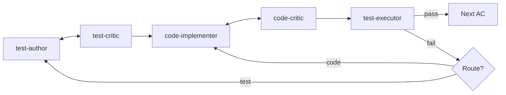

# Orchestrator Decision Tree

> How to decide which agent to call next based on the current state.

**Goal:** Route work efficiently, keep flows moving, avoid false halts.

**Prereqs:** Understanding of [laws of the swarm](../explanation/laws-of-the-swarm.md) (Law 5: Fix Forward) and the [agent handoff graph](../reference/agent-handoff-graph.md).

---

## How to Read This Guide

Use this guide when an agent returns with a handoff and you need to decide what happens next.

**Core principle:** Read the agent's prose handoff. Route on understanding, not parsing.

---

## Universal Decision Tree

```
Agent returns handoff
        |
        v
+------------------------------+
| What does the agent say?     |
+------------------------------+
        |
        +---> "Ready" / "Proceed" / "Complete"  -->  [Next station]
        |
        +---> "Needs X" / "Route to Z"          -->  [Route as recommended]
        |
        +---> "BLOCKED" / "Cannot proceed"      -->  [Classify: TRUE HALT?]
        |
        +---> "Design issue"                    -->  [Call specialist or bounce]
```

---

## The "Blocked" Decision Tree

Most "blocked" is just routing. Classify before acting:

| Condition | TRUE HALT? | Action |
|-----------|------------|--------|
| Mechanical failure (IO/permissions/tooling) | Yes | Fix environment first |
| Non-derivable decision (human must choose) | Yes | Surface at flow boundary |
| Unsafe boundary (secrets detected) | Yes | Route to secrets-sanitizer |
| **Anything else** | **No** | **Route to appropriate agent** |

### Translation Table: "Blocked" to "Route"

| Agent Says | Route To |
|------------|----------|
| "Blocked on lint errors" | auto-linter |
| "Blocked on test failures" | fixer or code-implementer |
| "Blocked on missing import" | code-implementer |
| "Blocked on design conflict" | design-optioneer |
| "Blocked on unclear spec" | clarifier |
| "Blocked on coverage" | test-author |

---

## Test Failure Decision Tree

| Failure Location | Route To | Reason |
|-----------------|----------|--------|
| NEW tests fail | code-implementer | Code needs to pass the test |
| EXISTING tests fail (regression) | code-implementer | New code broke existing behavior |
| Test syntax/import errors | test-author | Test itself needs repair |
| Intermittent (flaky) | flakiness-detector | Classify before routing |
| Timeout | fixer | May be infrastructure issue |

---

## Critic Severity Decision Tree

```
Critic returns findings
        |
        +---> CRITICAL         -->  Must fix. Route to writer.
        |
        +---> MAJOR
        |       +---> "iteration would help"   -->  Route to writer
        |       +---> "proceed with blockers"  -->  Proceed, issues recorded
        |
        +---> MINOR/STYLE      -->  Defer to Flow 4. Proceed.
        |
        +---> "work complete"  -->  Exit loop. Next station.
```

### Microloop Exit Conditions

| Critic Says | Action |
|-------------|--------|
| "Work is complete" | Exit loop, next station |
| "Mechanical failure" | Stop - fix environment |
| "Route to [agent]" | Follow recommendation |
| "Recommend iteration" | Rerun writer |
| "Won't help further" | Exit loop, blockers recorded |

---

## Per-Flow Quick Reference

### Flow 1: Signal

| Situation | Route |
|-----------|-------|
| Requirements unclear | clarifier |
| BDD doesn't match requirements | requirements-author |
| Scope too large | scope-assessor |

### Flow 2: Plan

| Situation | Route |
|-----------|-------|
| Multiple valid designs | design-optioneer |
| ADR conflicts with code | impact-analyzer |
| Contract doesn't match ADR | interface-designer or adr-author |

### Flow 3: Build (Most Complex)



| Situation | Route |
|-----------|-------|
| Tests fail after implementation | code-implementer |
| Tests themselves broken | test-author |
| Code critic finds MAJOR | code-implementer (one pass) |
| ADR interpretation question | design-optioneer (local resolution) |
| Post-green polish needed | code-implementer (one pass max) |
| Mutation survivors | test-author or fixer |
| Standards violations | fixer |

**AC termination:** test-executor Green AND orchestrator agrees nothing critical remains.

### Flow 4: Review

| Worklist Type | Route To |
|---------------|----------|
| TESTS | test-author |
| CORRECTNESS | code-implementer |
| STYLE | fixer |
| DOCS | doc-writer |

### Flow 5: Gate

| Finding | Route |
|---------|-------|
| Contract violations | Bounce to Build |
| Security issues | Bounded fix-forward |
| Coverage below threshold | Bounded fix-forward |
| All pass | merge-decider |

### Flow 6: Deploy

| Situation | Route |
|-----------|-------|
| Gate said MERGE | repo-operator |
| Gate said BOUNCE | Document, skip |
| Smoke fails | deploy-decider |

### Flow 7: Wisdom

Sequential analyst chain. Each produces insights for the next. No microloops.

---

## TRUE HALT Checklist

Before declaring halt, all must be true:

- [ ] **Mechanical failure?** (tooling broken, permissions)
- [ ] **Non-derivable decision?** (human authority required)
- [ ] **Unsafe boundary?** (secrets in staged content)

**If none apply: Route to an agent.**

---

## Common Anti-Patterns

| Wrong | Right |
|-------|-------|
| "BLOCKED: Code quality low" | Route to code-critic then code-implementer |
| "BLOCKED: Need human decision" | Make assumption, document, proceed |
| "BLOCKED: Missing upstream schema" | Call design-optioneer for local fix |
| "BLOCKED: Tests failing" | Route to code-implementer or test-author |

---

## Quick Routing Table

| From Agent | On Success | On Issues |
|------------|------------|-----------|
| code-implementer | code-critic | code-critic |
| code-critic | test-executor | code-implementer |
| test-author | test-critic | test-critic |
| test-critic | code-implementer | test-author |
| test-executor | next station | code-implementer or test-author |
| doc-writer | doc-critic | doc-critic |
| doc-critic | self-reviewer | doc-writer |
| secrets-sanitizer | repo-operator | code-implementer |

---

## See Also

- [Agent Handoff Graph](../reference/agent-handoff-graph.md) - Visual routing diagrams
- [Working with Microloops](working-with-microloops.md) - Writer/critic pattern
- [Laws of the Swarm](../explanation/laws-of-the-swarm.md) - Law 5 (Fix Forward)
- [Troubleshoot](troubleshoot.md) - Debugging failures
