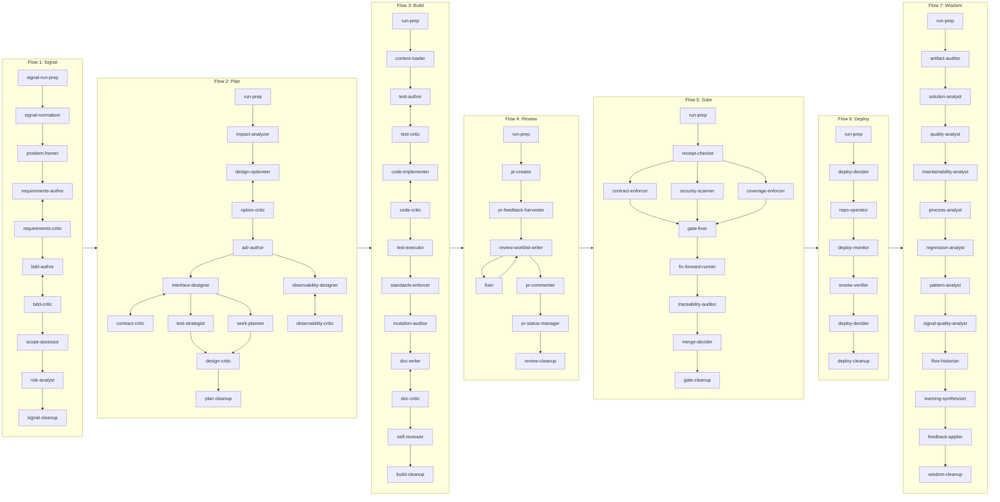
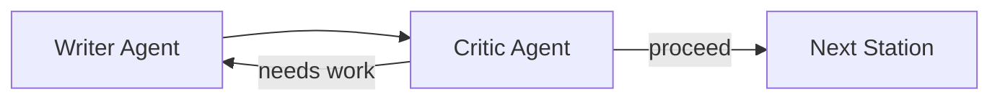
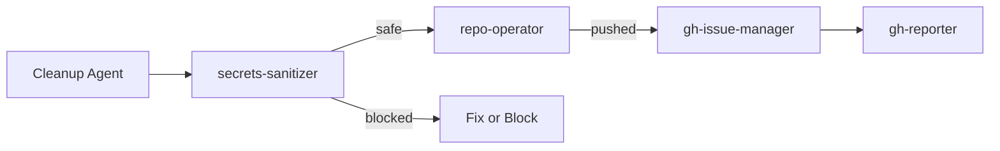
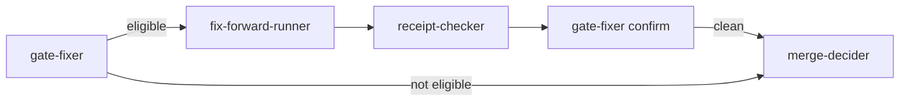

# Agent Handoff Graph

Quick reference for which agents hand off to which. Use this to understand routing patterns and agent relationships.

## High-Level Flow Diagram



## Cross-Flow Utility Agents

These agents are called across multiple flows:

| Agent               | Purpose                                      | Typical Callers                        |
| ------------------- | -------------------------------------------- | -------------------------------------- |
| `repo-operator`     | Git operations (branch, stage, commit, push) | All flow orchestrators                 |
| `secrets-sanitizer` | Pre-publish secrets scan                     | All flow orchestrators (before commit) |
| `clarifier`         | Capture open questions, research answers     | Flows 1-3                              |
| `fixer`             | Apply targeted fixes from critiques          | Flows 3-4                              |
| `risk-analyst`      | Risk assessment                              | Flows 1, 2, 5, 7                       |
| `policy-analyst`    | Policy compliance checks                     | Flows 2, 5                             |
| `gh-issue-manager`  | Update GitHub issue status                   | All flow orchestrators                 |
| `gh-reporter`       | Post summaries to GitHub                     | All flow orchestrators                 |

## Per-Flow Agent Sequences

### Flow 1: Signal

```
gh-issue-resolver
    |
repo-operator (ensure branch)
    |
signal-run-prep
    |
gh-researcher
    |
signal-normalizer
    |
problem-framer
    |
clarifier
    |
requirements-author <--> requirements-critic (microloop)
    |
bdd-author <--> bdd-critic (microloop)
    |
scope-assessor
    |
risk-analyst
    |
spec-auditor
    |
signal-cleanup --> secrets-sanitizer --> repo-operator --> gh-issue-manager --> gh-reporter
```

### Flow 2: Plan

```
run-prep
    |
repo-operator (ensure branch)
    |
clarifier
    |
impact-analyzer
    |
design-optioneer <--> option-critic (microloop)
    |
adr-author
    |
+------------------+------------------+------------------+
|                  |                  |                  |
interface-designer observability-     test-strategist   work-planner
        |          designer                |                 |
        v              |                   |                 |
contract-critic   observability-          |                 |
                     critic               |                 |
+------------------+------------------+------------------+
    |
design-critic
    |
policy-analyst
    |
plan-cleanup --> secrets-sanitizer --> repo-operator --> gh-issue-manager --> gh-reporter
```

### Flow 3: Build

```
run-prep --> repo-operator (ensure branch) --> context-loader --> clarifier
    |
    v
[For each AC in ac_matrix.md:]
    |
    +-- test-author <--> test-critic (microloop)
    |
    +-- code-implementer <--> code-critic (microloop)
    |
    +-- test-executor (AC-scoped)
    |
    +-- repo-operator (checkpoint push)
    |
    +-- pr-creator (create Draft PR)
    |
    +-- pr-feedback-harvester (check CRITICAL only)
    |
[After all ACs:]
    |
standards-enforcer
    |
test-executor (full suite)
    |
flakiness-detector (if failures)
    |
mutation-auditor
    |
fuzz-triager (if configured)
    |
fixer (if worklist)
    |
doc-writer <--> doc-critic (microloop)
    |
self-reviewer
    |
build-cleanup --> secrets-sanitizer --> repo-operator --> gh-issue-manager --> gh-reporter
```

### Flow 4: Review

```
run-prep --> repo-operator (ensure branch) --> pr-creator
    |
pr-feedback-harvester
    |
review-worklist-writer
    |
[Worklist loop - unbounded:]
    |
    +-- Route to fix-lane agent:
    |       TESTS --> test-author
    |       CORRECTNESS --> code-implementer
    |       STYLE --> fixer
    |       DOCS --> doc-writer
    |
    +-- review-worklist-writer (apply updates)
    |
    +-- Periodic: repo-operator --> secrets-sanitizer --> repo-operator --> pr-feedback-harvester
    |
[After worklist complete:]
    |
pr-commenter
    |
pr-status-manager (flip Draft to Ready)
    |
review-cleanup --> secrets-sanitizer --> repo-operator --> gh-issue-manager --> gh-reporter
```

### Flow 5: Gate

```
run-prep --> repo-operator (ensure branch)
    |
receipt-checker
    |
+------------------+------------------+
|                  |                  |
contract-enforcer  security-scanner  coverage-enforcer
|                  |                  |
+------------------+------------------+
    |
gate-fixer (report + fix-forward plan)
    |
fix-forward-runner (if eligible)
    |
traceability-auditor
    |
risk-analyst
    |
policy-analyst
    |
merge-decider
    |
gate-cleanup --> secrets-sanitizer --> repo-operator --> gh-issue-manager --> gh-reporter
```

### Flow 6: Deploy

```
run-prep --> repo-operator (ensure branch)
    |
deploy-decider (EARLY: read gate verdict)
    |
    +-- [If MERGE:]
    |       repo-operator (merge + tag + release)
    |           |
    |       deploy-monitor
    |           |
    |       smoke-verifier
    |           |
    |       deploy-decider (FINAL)
    |
    +-- [If BOUNCE:]
            skip merge, document why
    |
deploy-cleanup --> secrets-sanitizer --> repo-operator --> gh-issue-manager --> gh-reporter
```

### Flow 7: Wisdom

```
run-prep --> repo-operator (ensure branch)
    |
artifact-auditor
    |
solution-analyst
    |
quality-analyst
    |
maintainability-analyst
    |
process-analyst
    |
regression-analyst
    |
pattern-analyst
    |
signal-quality-analyst
    |
flow-historian
    |
learning-synthesizer
    |
feedback-applier
    |
traceability-auditor
    |
risk-analyst
    |
wisdom-cleanup --> secrets-sanitizer --> repo-operator --> gh-issue-manager --> gh-reporter
```

## Common Routing Patterns

### Microloop Pattern (Writer <-> Critic)

Used for iterative refinement until quality threshold met.



| Microloop      | Writer                 | Critic               |
| -------------- | ---------------------- | -------------------- |
| Requirements   | requirements-author    | requirements-critic  |
| BDD Scenarios  | bdd-author             | bdd-critic           |
| Design Options | design-optioneer       | option-critic        |
| Contracts      | interface-designer     | contract-critic      |
| Observability  | observability-designer | observability-critic |
| Tests          | test-author            | test-critic          |
| Code           | code-implementer       | code-critic          |
| Documentation  | doc-writer             | doc-critic           |

### Checkpoint Pattern (Sanitize -> Commit -> Report)

Used at end of every flow for safe publishing.



### Fix-Forward Pattern (Gate)

Used when Gate finds mechanical issues that can be auto-fixed.



## Agent Handoff Targets by Role

### Critics -> Fixers

| Critic               | Default Target         | When Issues Found         |
| -------------------- | ---------------------- | ------------------------- |
| requirements-critic  | requirements-author    | requirements-author       |
| bdd-critic           | bdd-author             | bdd-author                |
| option-critic        | design-optioneer       | design-optioneer          |
| contract-critic      | interface-designer     | interface-designer        |
| observability-critic | observability-designer | observability-designer    |
| test-critic          | code-implementer       | test-author or fixer      |
| code-critic          | test-critic            | code-implementer or fixer |
| doc-critic           | doc-writer             | doc-writer                |

### Infrastructure Agents

| Agent             | Hands Off To     | Condition                    |
| ----------------- | ---------------- | ---------------------------- |
| repo-operator     | gh-issue-manager | proceed_to_github_ops: true  |
| repo-operator     | caller           | proceed_to_github_ops: false |
| secrets-sanitizer | repo-operator    | safe_to_publish: true        |
| secrets-sanitizer | code-implementer | needs code fix               |

### Cleanup Agents

Each flow has a cleanup agent that finalizes receipts and updates index:

| Flow   | Cleanup Agent  | Hands Off To      |
| ------ | -------------- | ----------------- |
| Signal | signal-cleanup | secrets-sanitizer |
| Plan   | plan-cleanup   | secrets-sanitizer |
| Build  | build-cleanup  | secrets-sanitizer |
| Review | review-cleanup | secrets-sanitizer |
| Gate   | gate-cleanup   | secrets-sanitizer |
| Deploy | deploy-cleanup | secrets-sanitizer |
| Wisdom | wisdom-cleanup | secrets-sanitizer |

## Decision Points: When to Route Where

### From code-critic

| Finding                     | Route To         |
| --------------------------- | ---------------- |
| Implementation solid        | test-critic      |
| Small surgical fixes        | fixer            |
| Large implementation gaps   | code-implementer |
| ADR interpretation question | design-optioneer |

### From test-executor

| Result               | Route To           |
| -------------------- | ------------------ |
| All pass             | Next station       |
| Failures in new code | code-implementer   |
| Failures in tests    | test-author        |
| Flaky tests          | flakiness-detector |

### From merge-decider

| Decision               | Route To                   |
| ---------------------- | -------------------------- |
| MERGE                  | gate-cleanup (then Flow 6) |
| BOUNCE (code issues)   | Flow 3                     |
| BOUNCE (review issues) | Flow 4                     |
| BOUNCE (design issues) | Flow 2                     |

### From secrets-sanitizer

| Status                | Route To         |
| --------------------- | ---------------- |
| CLEAN/FIXED           | repo-operator    |
| BLOCKED (code secret) | code-implementer |
| BLOCKED (mechanical)  | Fix environment  |

## Agent Count by Flow

| Flow   | Primary Agents | Critics | Infrastructure |
| ------ | -------------- | ------- | -------------- |
| Signal | 8              | 3       | 5              |
| Plan   | 9              | 4       | 5              |
| Build  | 11             | 4       | 6              |
| Review | 6              | 0       | 5              |
| Gate   | 9              | 1       | 5              |
| Deploy | 4              | 0       | 5              |
| Wisdom | 12             | 0       | 5              |

Cross-flow agents (shared): 8

Total unique agents: ~84

## See Also

- [contracts.md](contracts.md) - Communication patterns between agents
- [run-state.md](run-state.md) - Artifact schemas
- [CLAUDE.md](../../CLAUDE.md) - Agent philosophy and handoff contract
