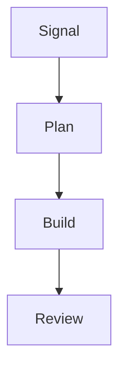
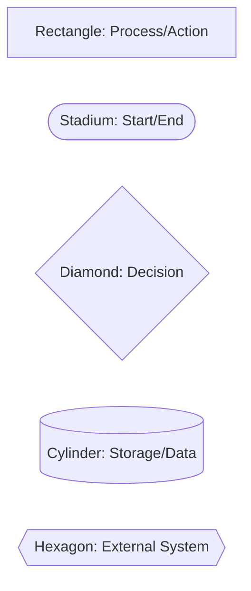
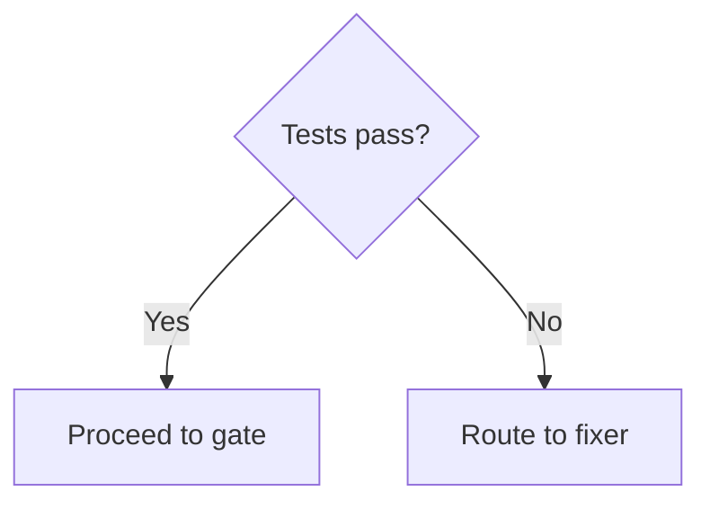
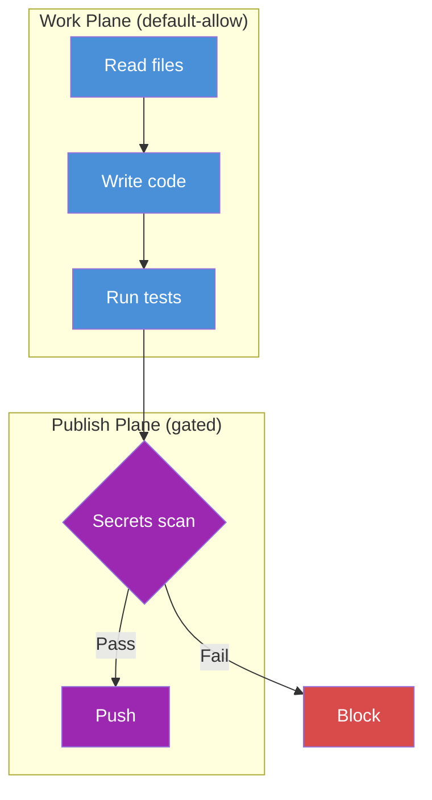
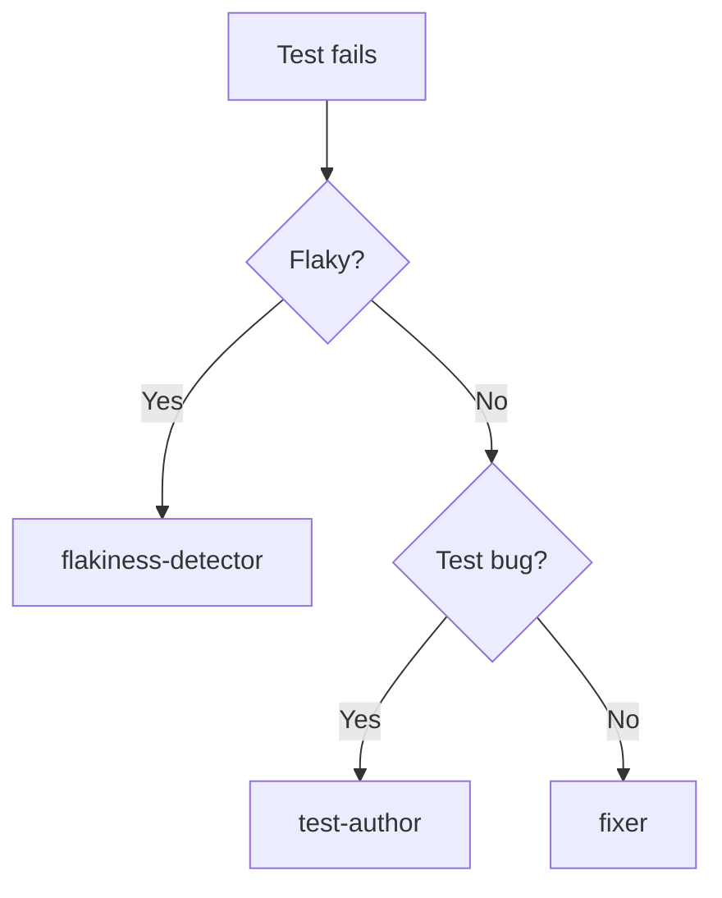
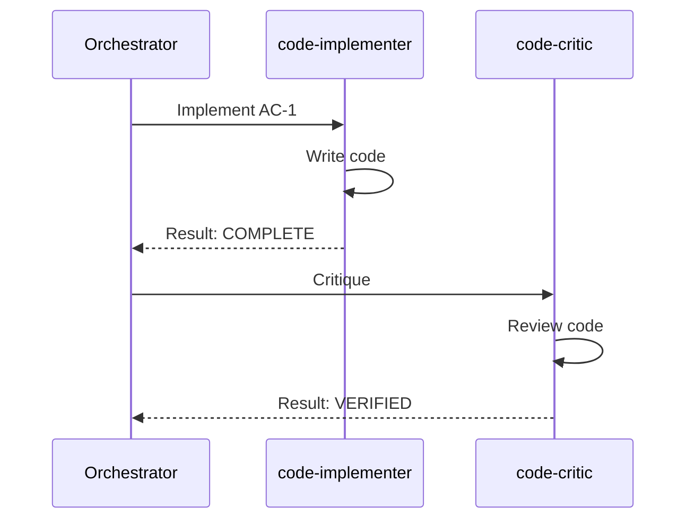
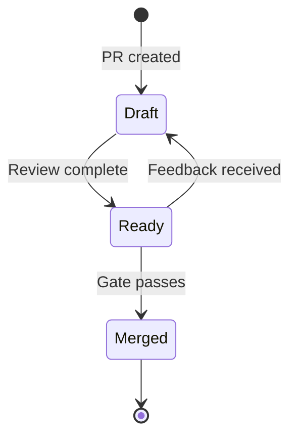
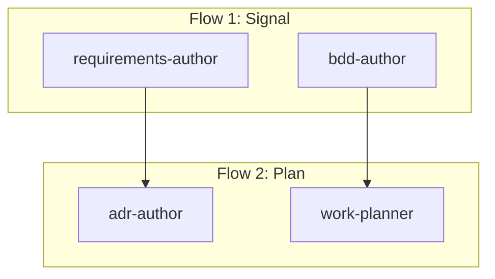
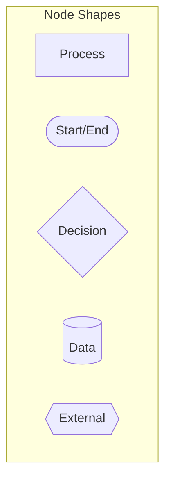
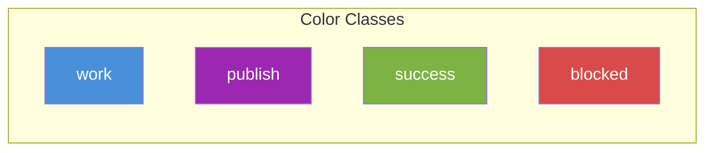

# Visual Style

> Standards for diagrams in DemoSwarm documentation.

---

## Purpose

Diagrams should clarify, not decorate. Every diagram must:

- **Answer a specific question** - What flow does this change? How do these components connect?
- **Be small enough to parse in 30 seconds** - If it takes longer, split it
- **Link to source artifacts when making claims** - Diagrams that describe behavior should point to the authoritative source

---

## Mermaid Conventions

### Flow Direction

| Direction | Use For |
|-----------|---------|
| Top-to-bottom (`TB`) | Sequential flows, agent chains, decision trees |
| Left-to-right (`LR`) | Data transformation pipelines, compressor patterns |



### Node Naming

- Use descriptive labels, not abbreviations (`requirements-author` not `req-auth`)
- Keep labels under 4 words
- Sentence case preferred (`Test executor` not `TEST EXECUTOR`)

### Node Shapes

Use shapes consistently for semantic meaning:



| Shape | Meaning | Example |
|-------|---------|---------|
| Rectangle `[text]` | Process or action | `[code-implementer]` |
| Stadium `([text])` | Start or end point | `([Request])` |
| Diamond `{text}` | Decision point | `{Tests pass?}` |
| Cylinder `[(text)]` | Storage or data | `[(requirements.md)]` |
| Hexagon `{{text}}` | External system | `{{GitHub API}}` |

### Edge Labels

- Keep short (1-3 words)
- Use for conditions or transformations
- Omit if the relationship is obvious



---

## Semantic Palette

Use consistent colors for semantic meaning. Colors supplement labels; do not rely on color alone.

| Color | Hex | Meaning | Use For |
|-------|-----|---------|---------|
| Blue | `#4A90D9` | Work plane | Internal operations, building, testing |
| Green | `#7CB342` | Success | Verified, clean, passing |
| Orange | `#F5A623` | Warning | Needs attention, partial success |
| Red | `#D94A4A` | Blocked | Failed, critical, stopped |
| Purple | `#9C27B0` | Publish plane | External boundaries, GitHub ops |
| Gray | `#9E9E9E` | Inactive | Historical, optional, skipped |

### Applying Colors in Mermaid


### Example: Two-Plane Visualization



---

## Diagram Types

### Flow Diagrams

Show sequence of operations.

**Use for:** Agent routing, flow progression, decision trees

**Keep to:** 5-10 nodes max



### Sequence Diagrams

Show interactions over time.

**Use for:** Agent handoffs, API calls, multi-party coordination

**Limit to:** 4-5 participants



### State Diagrams

Show state transitions.

**Use for:** Run states, PR states, gate decisions

**Keep to:** 5-7 states max



### Architecture Diagrams

Show structure.

**Use for:** System overview, component relationships

**Use subgraphs for grouping**



---

## Size Budgets

| Diagram Type | Max Nodes | Max Edges | If Larger... |
|--------------|-----------|-----------|--------------|
| Flow | 10 | 15 | Split into sub-diagrams |
| Sequence | 5 participants | 12 messages | Split into phases |
| State | 7 | 12 | Hierarchical states |
| Architecture | 12 | 20 | Use subgraphs |

**No hairballs.** If you cannot parse it in 30 seconds, it is too complex. Split it or remove detail.

---

## Diagram Discipline

### Every Diagram Must Have

1. **A title** - What question does this answer?
2. **Context** - Where does this fit? (preceding prose)
3. **Source links** - If it makes claims about artifacts (e.g., "tests run in this order"), link to the source

### Diagrams Should Not

- **Duplicate prose** - If the text already explains it, the diagram should show structure, not repeat content
- **Claim unverified behavior** - Do not diagram what "should" happen; diagram what does happen
- **Use colors randomly** - Every color must have semantic meaning (see palette above)
- **Include every detail** - That is what documentation is for; diagrams show shape and flow

### ASCII Art Alternative

For simple flows in code comments or when Mermaid is not available:

```
┌──────────────────────┐
│  requirements-author │
└──────────┬───────────┘
           ▼
┌──────────────────────┐
│    requirements.md   │
└──────────┬───────────┘
           ▼
┌──────────────────────┐
│   bdd-author         │
└──────────────────────┘
```

See [agent-data-flows.md](agent-data-flows.md) for examples of ASCII art diagrams.

---

## Accessibility

- **Do not rely solely on color** - Always include text labels
- **Ensure sufficient contrast** - Use white text (`color:#fff`) on colored backgrounds
- **Provide text descriptions for complex diagrams** - A sentence or two explaining what the diagram shows

---

## Tools

| Tool | When to Use |
|------|-------------|
| Mermaid | Primary choice; renders in GitHub, docs sites |
| ASCII art | Simple flows in code comments, fallback when Mermaid unavailable |

**Avoid:** External image files (cannot version, cannot search, break on path changes)

---

## Examples in This Repository

Diagrams in use that follow these conventions:

| Document | Diagram Type | Purpose |
|----------|--------------|---------|
| [pr-as-review-surface.md](../explanation/pr-as-review-surface.md) | Flow | Shows flow progression |
| [agent-data-flows.md](agent-data-flows.md) | ASCII art | Producer-consumer relationships |
| [architecture.md](../explanation/architecture.md) | ASCII art | Compressor pattern illustration |

---

## Quick Reference





---

## See Also

- [documentation-conventions.md](documentation-conventions.md) - Writing style for docs
- [agent-data-flows.md](agent-data-flows.md) - ASCII diagram examples
- [pr-as-review-surface.md](../explanation/pr-as-review-surface.md) - PR visualization patterns
- [architecture.md](../explanation/architecture.md) - System diagrams
